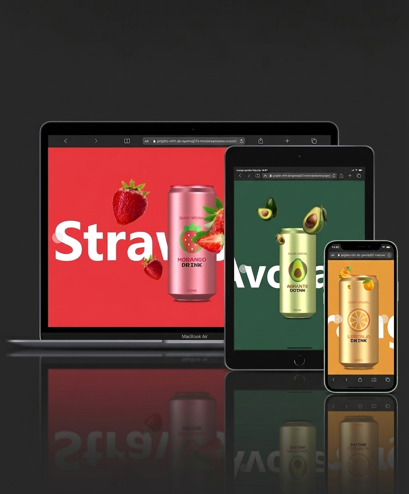

 # 🥤 DevRefri

<p>DevRefri é uma landing page dinâmica e intuitiva desenvolvida durante meus estudos no DevClub. O projeto apresenta diferentes sabores de refrigerantes por meio de um layout moderno, atrativo e interativo, proporcionando uma navegação leve e uma experiência visual envolvente para o usuário. A aplicação foi criada com foco em praticar conceitos de desenvolvimento front-end, explorando design responsivo, interatividade e organização de componentes. </p>

🔗 Deploy: https://marianaasoares.github.io/projeto-refri-do-dev/

📁 Repositório: https://github.com/MarianaASoares/projeto-refri-do-dev

---

 # :rocket: Tecnologias

      

---

# :camera: Preview

 

🔗 [Ver projeto](https://marianaasoares.github.io/projeto-refri-do-dev/) 

---


# :gear: Funcionalidades
<p> :heavy_check_mark: Landing page com layout moderno;</p>
<p> :heavy_check_mark: Destaque visual para diferentes sabores;</p>
<p> :heavy_check_mark: Animações dinâmicas e interativas;</p>
<p> :heavy_check_mark: Responsividade para diversos dispositivos.</p


---

---

# :file_folder: Como executar localmente

```bash
git clone https://github.com/MarianaASoares/projeto-refri-do-dev.git

cd projeto-refri-do-dev

```

<p>Depois, basta abrir o index.html no navegador.</p>


